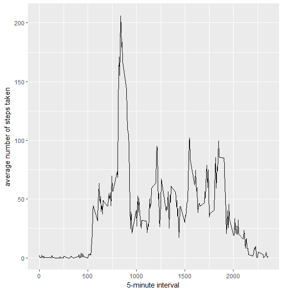
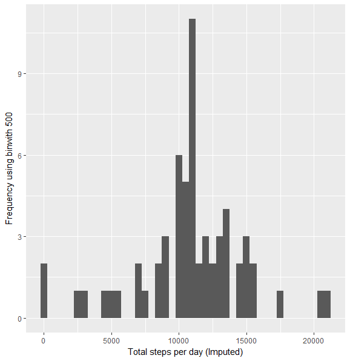
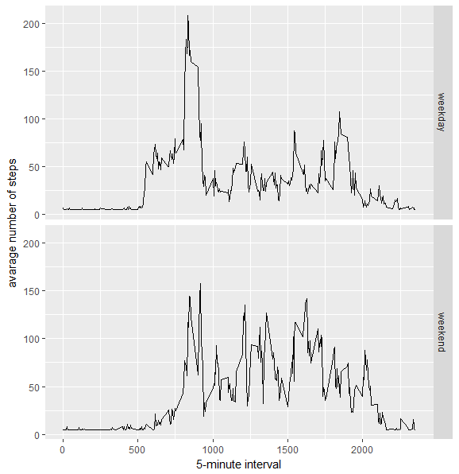

# Reproducible Research: Peer Assessment 1
library(ggplot2)
library(scales)
library(Hmisc)

## Loading and preprocessing the data
```r
activityData <- read.csv('activity.csv')
```
## What is mean total number of steps taken per day?

```r
stepsByDay <- tapply(activityData$steps, activityData$date, sum, na.rm=TRUE)
```

####Make a histogram of the total number of steps taken each day
```r
qplot(stepsByDay, xlab='Total steps per day', ylab='Frequency using binwith 500', binwidth=500)
```

####Calculate and report the mean and median total number of steps taken per day
```r
stepsByDayMean <- mean(stepsByDay)
stepsByDayMedian <- median(stepsByDay)
```

## What is the average daily activity pattern?
```r
averageStepsPerTimeBlock <- aggregate(x=list(meanSteps=activityData$steps), by=list(interval=activityData$interval), FUN=mean, na.rm=TRUE)
```
####Make a time series plot
```r
ggplot(data=averageStepsPerTimeBlock, aes(x=interval, y=meanSteps)) +
    geom_line() +
    xlab("5-minute interval") +
    ylab("average number of steps taken") 
```

## Imputing missing values
####Calculate and report the total number of missing values in the dataset
```r
numMissingValues <- length(which(is.na(activityData$steps)))
activityDataImputed <- activityData
activityDataImputed$steps <- impute(activityData$steps, fun=mean)
```

####Make a histogram of the total number of steps taken each day
```r
stepsByDayImputed <- tapply(activityDataImputed$steps, activityDataImputed$date, sum)
qplot(stepsByDayImputed, xlab='Total steps per day (Imputed)', ylab='Frequency using binwith 500', binwidth=500)
```


####and Calculate and report the mean and median total number of steps taken per day.
```r
stepsByDayMeanImputed <- mean(stepsByDayImputed)
stepsByDayMedianImputed <- median(stepsByDayImputed)
```
## Are there differences in activity patterns between weekdays and weekends?

####1. Create a new factor variable in the dataset with two levels - "weekday" and "weekend" indicating whether a given date is a weekday or weekend day.
```r
activityDataImputed$dateType <-  ifelse(as.POSIXlt(activityDataImputed$date)$wday %in% c(0,6), 'weekend', 'weekday')
```
####2. Make a panel plot containing a time series plot

```r
averagedActivityDataImputed <- aggregate(steps ~ interval + dateType, data=activityDataImputed, mean)
ggplot(averagedActivityDataImputed, aes(interval, steps)) + 
    geom_line() + 
    facet_grid(dateType ~ .) +
    xlab("5-minute interval") + 
    ylab("avarage number of steps")
```
